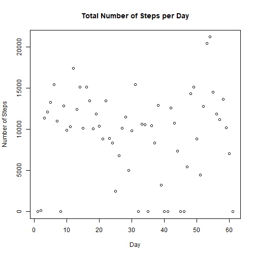
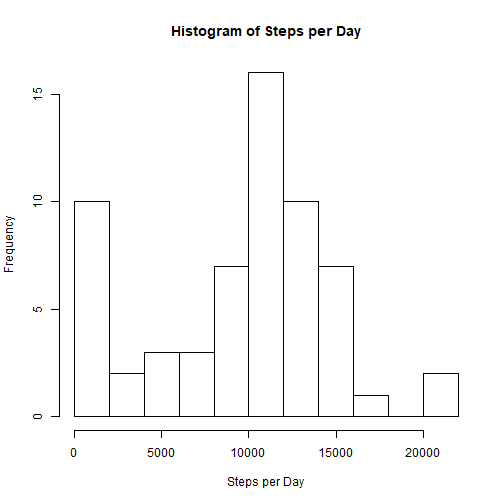
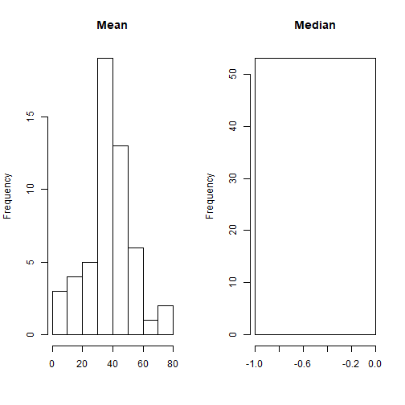
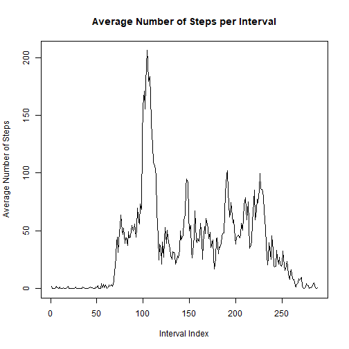
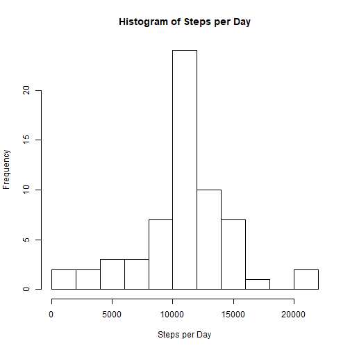
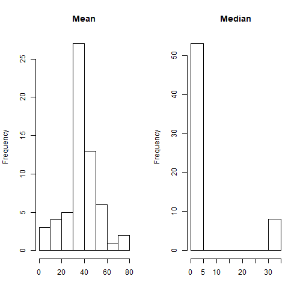

# Reproducible Research: Course Project 1


## Analysis on Original Dataset

Load the activity monitoring dataset into the R environment and check the first few entries using head().


```r
activity_data <- read.csv("activity.csv", sep=",",header=TRUE)
head(activity_data)
```

```
##   steps       date interval
## 1    NA 2012-10-01        0
## 2    NA 2012-10-01        5
## 3    NA 2012-10-01       10
## 4    NA 2012-10-01       15
## 5    NA 2012-10-01       20
## 6    NA 2012-10-01       25
```

Plot the total number of steps for each day.



The following plot shows the histogram of number of steps taken per day. Note that the bin-width is set to '10' to give us a better visualization of the data.



Now take a look into the data's mean and median for each day.



Notice that steps_median plot does not show any data at all. However, looking at its summary, we can verify that the median data contains a vector of 0s and NAs and would technically plot a null graph.


```
##    Min. 1st Qu.  Median    Mean 3rd Qu.    Max.    NA's 
##       0       0       0       0       0       0       8
```

Plot time-series data of average number of steps per interval across all days. The maximum average value of number of steps is also seen below along with its corresponding interval. The maximum average is 206.1698 steps during the 835th interval for the day.



```
##      835 
## 206.1698
```

##Analysis of Imputed Dataset

Calculate the number of NAs present in the dataset. Impute missing NA values using the daily interval averages computed from the previous section. Now check the first few entries of the new dataset by using head().

Looking at the graph below, the graph differs significantly when it comes to the frequency of the distribution of number of steps. Since the imputed data came from the interval averages, the distribution values are more frequent at the center of the graph compared to the previous histogram. As with the previous histogram, bin-width is set to '10'.

The new mean and median is also reported below using a histogram as was previously done in the previous section. Due to imputed data, the median plot shows us 2 value groups as compared to the original median vector which only held 0s and NAs.


```
## [1] 2304
```

```
##       steps       date interval
## 1 1.7169811 2012-10-01        0
## 2 0.3396226 2012-10-01        5
## 3 0.1320755 2012-10-01       10
## 4 0.1509434 2012-10-01       15
## 5 0.0754717 2012-10-01       20
## 6 2.0943396 2012-10-01       25
```



A new column, day_type, is added to the new dataset for this section. The variable day_type can take only 1 of two values: "weekday" and "weekend". The 1st few entries are shown using head(). The graph below shows the differences between weekday and weekend daily averages. From the graphs, weekend daily averages are greater during the middle and latter parts of the day which indicates greater activity during these times.


```
##       steps       date interval day_type
## 1 1.7169811 2012-10-01        0  weekday
## 2 0.3396226 2012-10-01        5  weekday
## 3 0.1320755 2012-10-01       10  weekday
## 4 0.1509434 2012-10-01       15  weekday
## 5 0.0754717 2012-10-01       20  weekday
## 6 2.0943396 2012-10-01       25  weekday
```


